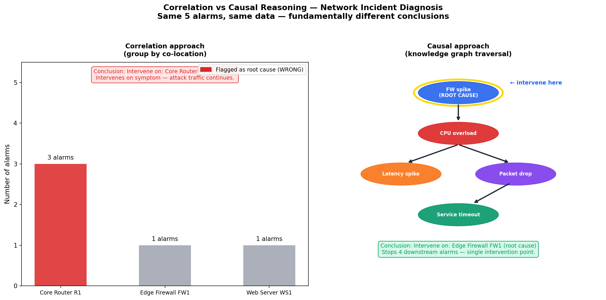
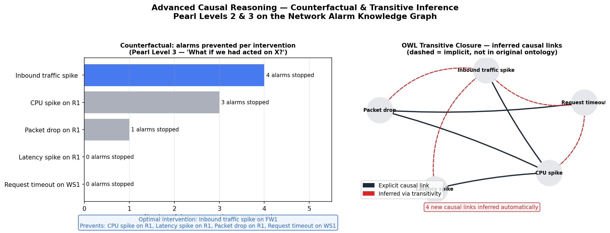

# alarm-correlation-rdf

> **Network alarm correlation and causal reasoning using RDF knowledge graph and SPARQL**

[](https://www.python.org/)
[](LICENSE)
[]()

---

## The Problem

Network monitoring systems generate hundreds of alarms per minute.
Most are not independent — they share causal or correlational
relationships rooted in a single underlying incident.

The core diagnostic challenge is distinguishing between:

- **Correlated alarms**: they appear together statistically, but neither causes the other
- **Causally linked alarms**: one directly causes the next

This distinction is critical for remediation. Acting on a correlated
symptom wastes time and resources. Acting on the root cause stops all
downstream alarms simultaneously.

Most ML-based monitoring systems detect co-occurrence. This prototype
shows what structured causal reasoning via a knowledge graph enables
instead.

The ontology is inspired by **NORIA-O** (Tailhardat, Chabot, Troncy —
ESWC 2023), the reference ontology for anomaly detection in ICT systems
developed at Orange Innovation / EURECOM.

---

## Scenario

A DDoS attack triggers 5 alarms across 3 network devices:

| Alarm | Device | Severity |
|---|---|---|
| Inbound traffic spike | Firewall FW1 | HIGH |
| CPU overload | Router R1 | HIGH |
| Latency spike | Router R1 | HIGH |
| Packet drop | Router R1 | CRITICAL |
| Service timeout | Web Server WS1 | MEDIUM |

**Causal chain:** FW traffic spike → CPU overload → {latency, packet drop} → timeout

---

## What the system can do

### 1. SPARQL diagnostic queries (`src/alarm_correlation.py`)

Five queries covering the full diagnostic pipeline:

```
Q1 — List all alarms with severity and device
Q2 — What is the causal chain? Which alarm is the root cause?
Q3 — Which alarms are correlated (same cause, not causal)?
Q4 — Which device concentrates the most alarms?
Q5 — How does this incident map to MITRE ATT&CK?
```

**Key finding from Q4 vs Q2 — the co-location trap:**

Q4 flags Router R1 (3 alarms) as the problem device.
Q2 reveals the root cause is on Firewall FW1 (1 alarm only).

A correlation-based system investigates R1. The causal KG
identifies FW1 as the single intervention point.


---

### 2. Correlation vs Causal comparison (`src/causal_vs_correlation.py`)

Explicit side-by-side comparison: same 5 alarms, same raw data,
two different reasoning approaches, fundamentally different conclusions.



---

### 3. Counterfactual reasoning & OWL transitive closure (`src/causal_reasoning.py`)

**Counterfactual (Pearl Level 3):**
For each alarm, answers: *"If we had intervened on X, how many alarms would not have occurred?"*

```
Inbound traffic spike (FW1) → prevents 4 alarms  ← optimal
CPU overload (R1)           → prevents 3 alarms
Packet drop (R1)            → prevents 1 alarm
Latency spike (R1)          → prevents 0 alarms
Service timeout (WS1)       → prevents 0 alarms
```

**OWL transitive closure:**
If A causes B and B causes C, the system automatically infers that A causes C —
even if this link was never explicitly written in the ontology.

```
4 explicit causal links in the ontology
4 new causal links inferred automatically:
  CPU overload     → Service timeout  (via Packet drop)
  FW traffic spike → Latency spike    (via CPU)
  FW traffic spike → Packet drop      (via CPU)
  FW traffic spike → Service timeout  (via CPU → Packet drop)
```



---

## Results summary

| Capability | What it shows |
|---|---|
| SPARQL Q2 vs Q3 | Causal vs correlational reasoning on real alarm data |
| Co-location trap | R1 (3 alarms) is not the root cause — FW1 (1 alarm) is |
| Counterfactual | Optimal intervention identified: FW1 stops all 4 downstream alarms |
| OWL transitive | 4 implicit causal links inferred without explicit encoding |
| MITRE ATT&CK | Incident automatically mapped to T1498 |

---

## Scientific context

Pearl's causal hierarchy, illustrated concretely on network alarms:

- **Level 1 — Association**: Latency and Packet drop co-occur on R1 (Q3)
- **Level 2 — Intervention**: Block FW1 traffic, CPU overload stops, all downstream alarms stop (Q2)
- **Level 3 — Counterfactual**: Without the FW spike, would CPU overload have occurred? No — the KG proves it (counterfactual analysis)

All three levels are impossible with correlation-based ML alone.
They require structured causal knowledge encoded in the graph.

**NORIA-O alignment:**
Ontology classes and properties mirror NORIA-O's core structure.
This prototype is a minimal instantiation of NORIA-O for a concrete DDoS scenario.

---

## Connection to other projects

| Project | Layer | Core question |
|---|---|---|
| [stream-anomaly-benchmark](https://github.com/moncefabel/stream-anomaly-benchmark) | Detection | When to trigger a decision under time constraints |
| [belief-fusion-diagnosis](https://github.com/moncefabel/belief-fusion-diagnosis) | Arbitration | How to fuse conflicting agent beliefs |
| **alarm-correlation-rdf** | Reasoning | What to reason about — causal structure of alarms |

Together: **detect early → fuse beliefs → reason causally**

---

## Quickstart

```bash
git clone https://github.com/moncefabel/alarm-correlation-rdf
cd alarm-correlation-rdf
uv venv && source .venv/bin/activate
uv pip install -r requirements.txt

python src/alarm_correlation.py      # SPARQL queries
python src/causal_vs_correlation.py  # comparison
python src/causal_reasoning.py       # counterfactual + OWL
```

---

## Structure

```
alarm-correlation-rdf/
├── ontology/
│   └── alarm_ontology.ttl           # RDF/OWL ontology (102 triples)
├── src/
│   ├── alarm_correlation.py         # 5 SPARQL diagnostic queries
│   ├── causal_vs_correlation.py     # explicit comparison
│   └── causal_reasoning.py          # counterfactual + OWL transitive
├── results/
│   ├── alarm_correlation_graph.png
│   ├── causal_vs_correlation.png
│   └── causal_reasoning.png
├── README.md
├── RESEARCH_NOTES.md
└── requirements.txt
```

---

## References

- Tailhardat, L., Chabot, Y., & Troncy, R. (2023). NORIA-O: an Ontology for Anomaly Detection and Incident Management in ICT Systems. *ESWC 2023*.
- Pearl, J. (2009). *Causality: Models, Reasoning, and Inference* (2nd ed.). Cambridge University Press.
- MITRE ATT&CK. T1498 — Network Denial of Service. https://attack.mitre.org/techniques/T1498/

---

## Author

**Moncef Bouhabel** — ML Engineer, Master ML for Data Science, Université Paris Cité
[github.com/moncefabel](https://github.com/moncefabel)