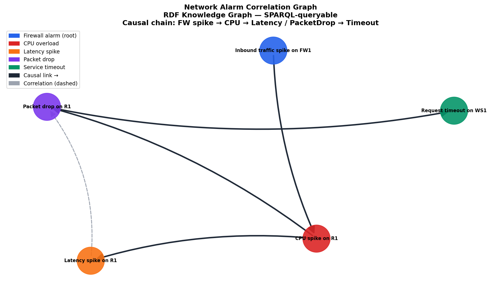

# alarm-correlation-rdf

> **Network alarm correlation using RDF knowledge graph and SPARQL**

[](https://www.python.org/)
[](LICENSE)
[]()

---

## Motivation

Network monitoring systems generate hundreds of alarms per minute. Most
of these alarms are **not independent** — they share causal or
correlational relationships rooted in a single underlying incident.

The core diagnostic challenge — **Verrou 1** of the target CIFRE thesis
(Orange Innovation / EURECOM, ref. 2026-51517) — is:

> *"ML models detect statistical correlations. Incident diagnosis requires
> causal reasoning. How do we lift a correlational agent toward structured
> causal inference via a knowledge graph enriched with security ontologies?"*

This repository prototypes the semantic layer that enables this lift:
an RDF knowledge graph of network alarms, queryable via SPARQL, modelling
both causal chains and correlational relationships.

The ontology is inspired by **NORIA-O** (Tailhardat et al., ESWC 2023),
the reference ontology for anomaly detection in ICT systems developed
at Orange Innovation.

---

## Scenario

A DDoS attack triggers 5 alarms across 3 network devices:

| Alarm | Device | Severity | Time |
|---|---|---|---|
| Inbound traffic spike | Firewall FW1 | HIGH | 13:59:45 |
| CPU overload | Router R1 | HIGH | 14:00:00 |
| High latency | Router R1 | HIGH | 14:01:30 |
| Packet drop | Router R1 | CRITICAL | 14:02:00 |
| Service timeout | Web Server WS1 | MEDIUM | 14:03:00 |

**Causal chain:** FW traffic spike → CPU overload → latency + packet drop → timeout

Without causal reasoning, these 5 alarms appear as 5 independent incidents
requiring 5 separate investigations. The knowledge graph identifies
**one root cause** and **one intervention point**.

---

## SPARQL Queries

Five diagnostic queries demonstrate the reasoning capabilities of the graph:

| Query | Question |
|---|---|
| Q1 | List all alarms with severity and affected device |
| Q2 | What is the causal chain? Which alarm is the root cause? |
| Q3 | Which alarms are correlated (same cause, not causal)? |
| Q4 | Which device concentrates the most alarms? |
| Q5 | How does this incident map to MITRE ATT&CK? |

---

## Results

```
Q2 — Causal chain:
  FirewallSpike  → CPU spike
  CPU spike      → Latency spike
  CPU spike      → Packet drop
  Packet drop    → Service timeout

Q3 — Correlated alarms:
  Latency spike ↔ Packet drop  (both caused by CPU, not by each other)

Q4 — Alarm concentration:
  Router R1    : 3 alarms  ← hotspot
  Firewall FW1 : 1 alarm   ← root cause device
  Web Server   : 1 alarm   ← downstream effect

Q5 — MITRE ATT&CK mapping:
  Incident → Volumetric DDoS → T1498
```



---

## Key Finding

Correlation alone would flag 5 independent anomalies. Causal reasoning
identifies **one root cause** (firewall inbound spike) and **one
intervention point** — shutting off the attack traffic at FW1 resolves
all downstream alarms simultaneously.

This is the empirical argument for Verrou 1: ML agents operating on
statistical correlations cannot produce this diagnosis. A knowledge graph
with explicit causal structure can.

---

## Thesis Implications

**Verrou 1 — Causality vs Correlation:**
Q2 vs Q3 illustrates the distinction concretely. The knowledge graph
encodes Pearl's causal hierarchy: association (Q3), intervention
(which device to act on), and counterfactual (would removing FW spike
prevent CPU overload? Yes).

**Verrou 2 — KG as Semantic Contract:**
The RDF graph acts as a shared semantic space for heterogeneous agents.
An ML agent can write its alarm predictions as RDF triples; a rule-based
expert can query them via SPARQL. They cooperate without sharing internal
representations.

**NORIA-O connection:**
The ontology classes (Alarm, Incident, NetworkDevice, AttackPattern) and
properties (causallyLinkedTo, correlatedWith, affectsDevice) directly
mirror NORIA-O's core structure. This prototype is an instantiation of
the NORIA-O design for a concrete incident scenario.

---

## Quickstart

```bash
git clone https://github.com/moncefabel/alarm-correlation-rdf
cd alarm-correlation-rdf
uv venv && source .venv/bin/activate
uv pip install -r requirements.txt

python src/alarm_correlation.py
```

---

## Structure

```
alarm-correlation-rdf/
├── ontology/
│   └── network_alarm.ttl    # RDF/OWL ontology (Turtle format)
├── src/
│   ├── alarm_correlation.py # SPARQL queries + graph visualisation
│   └── __init__.py
├── results/
│   └── alarm_correlation_graph.png
├── README.md
├── RESEARCH_NOTES.md
└── requirements.txt
```

---

## Connection to other projects

| Project | Layer | Thesis verrou |
|---|---|---|
| [stream-anomaly-benchmark](https://github.com/moncefabel/stream-anomaly-benchmark) | When to trigger | Verrou 4 |
| [belief-fusion-diagnosis](https://github.com/moncefabel/belief-fusion-diagnosis) | How to arbitrate | Verrou 3 |
| **alarm-correlation-rdf** | What to reason about | Verrou 1 & 2 |

Together the three repositories prototype the full diagnostic pipeline:
**detect early → fuse beliefs → reason causally**.

---

## References

- Tailhardat, L., Chabot, Y., & Troncy, R. (2023). NORIA-O: an Ontology
  for Anomaly Detection and Incident Management in ICT Systems. *ESWC 2023*.
- Pearl, J. (2009). *Causality: Models, Reasoning, and Inference* (2nd ed.).
  Cambridge University Press.
- MITRE ATT&CK Framework. T1498 — Network Denial of Service.
  https://attack.mitre.org/techniques/T1498/
- Brickley, D., & Guha, R. V. (2014). RDF Schema 1.1. W3C Recommendation.

---

## Author

**Moncef Bouhabel** — ML Engineer, Master ML for Data Science, Université Paris Cité
[github.com/moncefabel](https://github.com/moncefabel) 